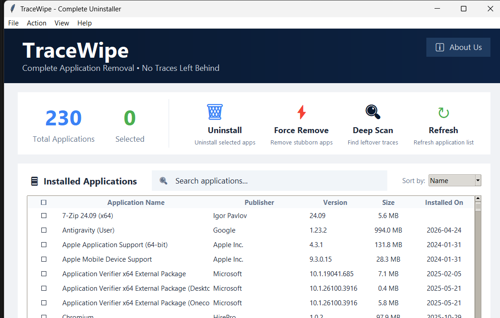

<div align="center">
  <h1>🚀 TraceWipe</h1>
  <h3>Complete Application Removal Engine</h3>
  
  <p>
    <a href="https://github.com/Maniredii/TraceWipe/releases/tag/v1.0.0"></a>
    
    
    
  </p>

  

  <p><b>A modern, feature-rich Windows application that completely removes programs and cleans up all leftover files and traces. Built to compete with industry leaders like IObit Uninstaller, Revo Uninstaller, and Geek Uninstaller.</b></p>
</div>


## Screenshots / Walkthrough

### Step 1


### Step 2


### Step 3


### Step 4


### Step 5


## ✨ Key Features

### 🎯 Core Functionality
- **Clean Modern UI**: Beautiful, intuitive interface with professional design
- **Complete App List**: Scans Windows registry to show all installed programs with details
- **Native Uninstall**: Launches the official uninstaller for selected applications
- **Smart Leftover Detection**: Searches common locations for residual files and folders
- **Thorough Cleanup**: Removes all traces after uninstallation
- **Real-time Activity Log**: Track every action with timestamped detailed logging

### 🚀 Advanced Features
- **Batch Uninstall**: Remove multiple applications at once - save time!
- **Force Remove**: Delete stubborn apps that won't uninstall normally
- **Checkbox Selection**: Easy multi-select with visual checkboxes
- **Smart Search**: Instantly filter apps by name or publisher
- **Sort Options**: Sort by Name, Publisher, or Size
- **Size Display**: See how much space each app uses (MB/GB)
- **Statistics Dashboard**: View total apps and selected count at a glance
- **Select All/Clear**: Quick selection controls for batch operations

### 💡 User-Friendly Design
- **No Installation Required**: Standalone .exe file
- **No Python Needed**: Works on any Windows PC
- **Emoji Icons**: Visual indicators for better UX
- **Hover Effects**: Interactive buttons with smooth animations
- **Color-Coded Actions**: Different colors for different operations
- **Timestamps**: Every log entry shows exact time
- **Clear Log Button**: Keep your workspace clean

## Requirements

- Windows OS
- Python 3.6 or higher
- Administrator privileges (recommended for full functionality)

## Installation

### Option 1: Use the EXE file (Recommended)
1. Download `TraceWipe.exe` from the `dist` folder
2. Right-click and select "Run as Administrator"
3. That's it! No Python installation needed

### Option 2: Run from Python source
1. Make sure Python is installed on your system
2. No additional packages needed (uses built-in libraries)
3. Run: `python uninstaller.py`

## Building the EXE yourself

If you want to build the executable from source:

1. Install Python 3.6 or higher
2. Double-click `build_exe.bat` (or run it from command prompt)
3. Wait for the build to complete
4. Find your executable in the `dist` folder

**Manual build command:**
```bash
pip install pyinstaller
pyinstaller --onefile --windowed --name "TraceWipe" uninstaller.py
```

## Usage

1. Run the application (either the .exe or Python script)
2. **Important:** Right-click and "Run as Administrator" for full functionality

2. **To uninstall a single application:**
   - Browse or search for an app in the list
   - Click on the app to select it
   - Click "✕ Uninstall Selected"
   - Complete the uninstaller wizard that appears
   - Click "🔍 Scan Leftovers" to find remaining files
   - Confirm deletion to clean up completely

3. **To batch uninstall multiple apps:**
   - Click the checkbox next to each app you want to remove
   - Or click "Select All" to select everything
   - Click "📦 Batch Uninstall"
   - Confirm the operation
   - All selected apps will be uninstalled sequentially

4. **To force remove a stubborn app:**
   - Select the problematic application
   - Click "⚡ Force Remove"
   - Confirm the warning dialog
   - The app's files and registry entries will be deleted

5. **To search and sort:**
   - Use the search box to filter apps instantly
   - Use the "Sort by" dropdown to organize by Name, Publisher, or Size
   - Click column headers to select apps

## Why Choose TraceWipe?

### vs. Built-in Windows Uninstaller
- ✅ Finds and removes leftover files
- ✅ Batch uninstall multiple apps
- ✅ Force remove stubborn programs
- ✅ Shows app sizes
- ✅ Advanced search and sort

### vs. Other Uninstallers (IObit, Revo, Geek)
- ✅ **100% Free** - No premium version, no ads
- ✅ **Lightweight** - Single 8-12 MB executable
- ✅ **Modern UI** - Clean, intuitive design
- ✅ **No Installation** - Portable, run anywhere
- ✅ **Open Source** - Transparent and trustworthy
- ✅ **Fast** - Instant search and filtering
- ✅ **Simple** - Easy for everyone to use

## Locations Scanned

The tool searches for leftover files in:
- `%APPDATA%` (User application data)
- `%LOCALAPPDATA%` (Local application data)
- `%PROGRAMDATA%` (Program data)
- `%PROGRAMFILES%` (Program Files)
- `%PROGRAMFILES(X86)%` (Program Files x86)

## Important Notes

- **Run as Administrator** for best results
- Always review items before deleting
- Some system files may require special permissions
- Create a system restore point before major cleanups

## Safety

The tool only deletes items that match the application name. However:
- Always backup important data
- Review the log before confirming deletion
- Some files may be in use and cannot be deleted

## Troubleshooting

**"Access Denied" errors:**
- Run the application as Administrator
- Close the application you're trying to uninstall

**Application not listed:**
- Click "Refresh List"
- Some portable apps don't register in Windows

**Can't delete some files:**
- Files may be in use by another process
- Restart your computer and try again
